### Task 1
```
wsl --install -d Ubuntu-20.04
sudo apt install gitweb
sudo api install lighttpd
git instaweb
```

### Task 2
```
git merge --squash master
git branch -D ci
```
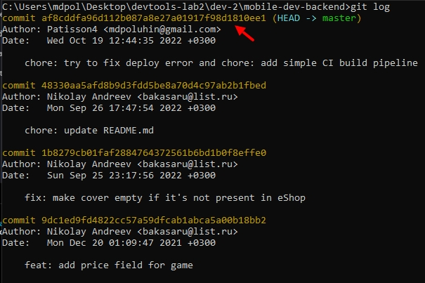
### Task 3
```
git log --graph --decorate $(git rev-list -g --all)
git branch old-master aae7df
```
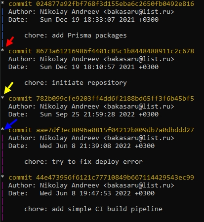
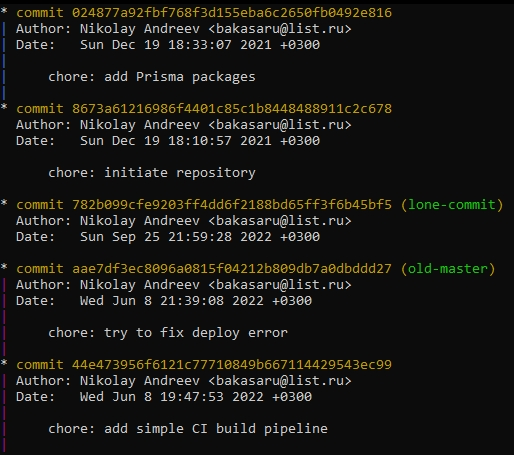
### Task 4
```
git blame -L 32,32 prisma/seed.ts
```
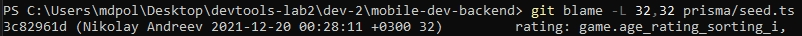
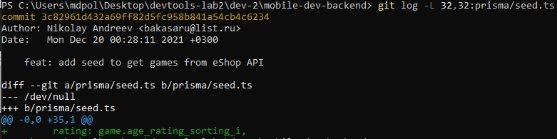
### Task 5
```
npm install
git bisect start

npm run test
git bisect [bad или good пока работает бинпоиск]
```
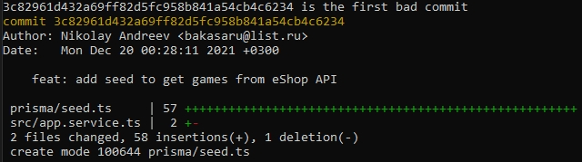
### Task 6
```
git filter-branch --tree-filter "rm -f .env" -- --all
```
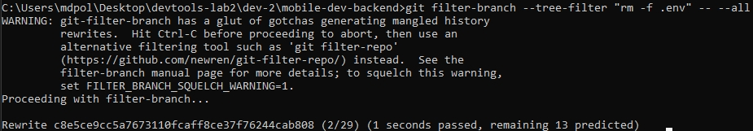
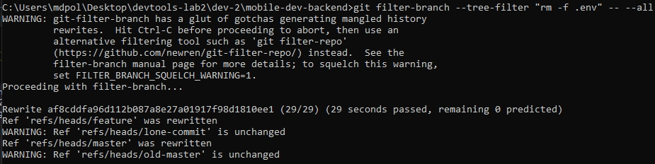
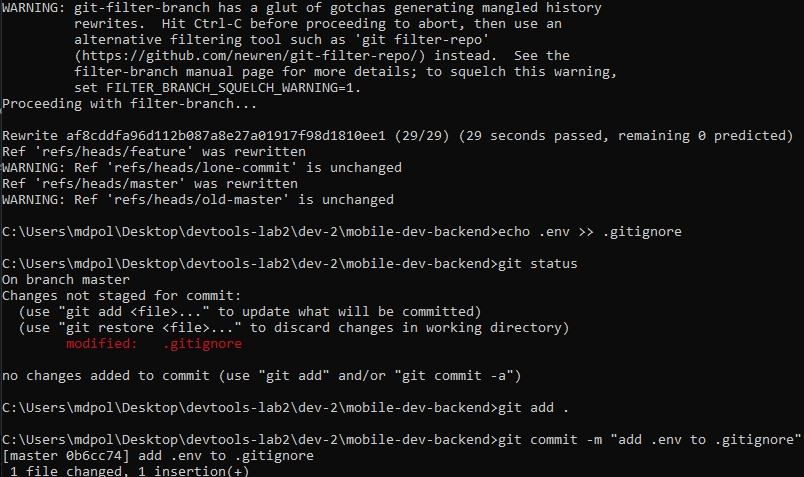
### Task 7
```
git rebase -i HEAD~3 --exec "git commit --amend --reset-author --no-edit"
```
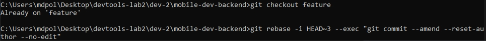
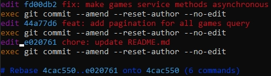
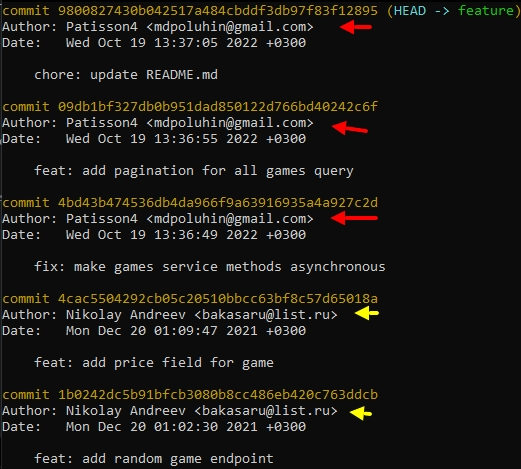
### Task 8
```
git config rerere.enabled true
git merge feature
```
### Task 9
```
npm start
```
### Task 10
```
git gc
```
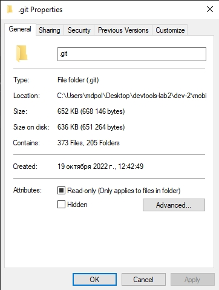
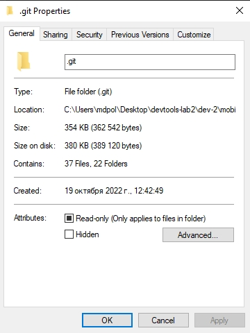
### Task 11
```
git checkout -b report
git add docs/REPORT.md
git add -p docs/REPORT.md
```